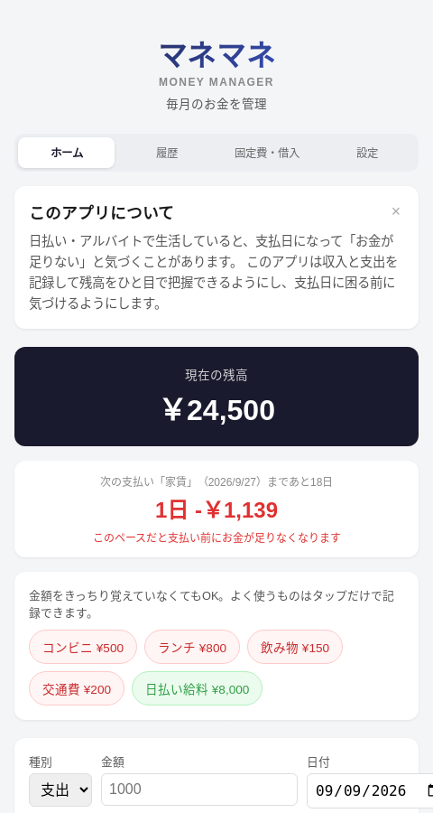
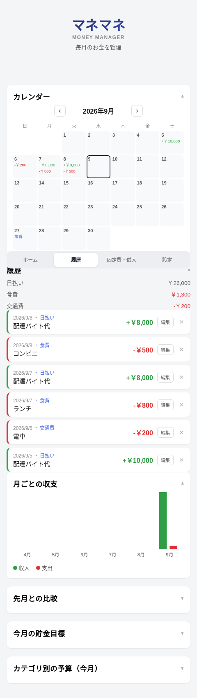
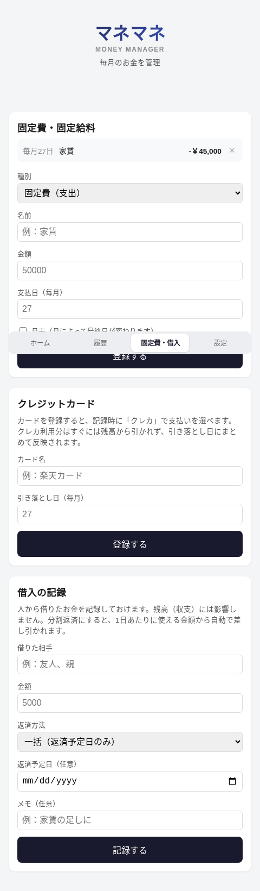

# マネマネ（Money Manager）

日払い・アルバイトで生活する人向けの家計管理アプリです。「支払日になってお金が足りないと気づく」という課題を、収支の記録と可視化によって事前に防ぐことを目的にしています。

🔗 **本番環境**: https://money-manager-bice-rho.vercel.app

## 背景・課題

大学を辞めて配達のフリーターとして働き、日払いで生活する21歳を想定ターゲットにしています。毎日お金は入ってくるものの、収支を意識せずに使ってしまい、家賃などの支払日になって初めて「お金が足りない」と気づき、人に借りたり自己破産に至ったりする——という課題を解決するために作りました。

「使いすぎを注意する」だけでは続かないと考え、

- 使った金額を覚えていなくても、よく使うものはワンタップで記録できる
- 「先月比較」「予算」など数字の多い機能はデフォルトで折りたたみ、情報過多で挫折しないようにする
- 収支を時系列でシミュレーションし、「本当に危ないときだけ」警告する

といった、続けやすさを優先した設計にしています。

## スクリーンショット

| ホーム | 履歴・カレンダー | 固定費・借入 |
|---|---|---|
|  |  |  |

## デモアカウント

登録なしで実際の画面を試したい場合は、以下のアカウントでログインできます（サンプルデータ入り）。

```
メールアドレス: demo@example.com
パスワード:     demo12345
```

## 主な機能

- **収支管理**：収入・支出の記録、クイック入力ボタン、取引の編集・削除
- **支払日アラート**：固定費・固定給料（収入）を登録し、収支を時系列でシミュレーションして残高不足を事前に警告
- **1日あたりの目安金額**：次の支払い日までに使える金額を自動計算（借入の返済負担・クレジットカードの未引き落とし分も加味）
- **クレジットカード管理**：カード払いの取引は引き落とし日にまとめて残高へ反映
- **借入の記録**：一括／分割（毎日・毎週・毎月）返済に対応
- **カレンダー・月次グラフ・先月比較・カテゴリ別予算・貯金目標**
- **アカウント機能**：メールアドレス＋パスワードでの登録・ログイン・ログアウト・パスワード変更
- **共有リンク**：残高とカテゴリ別収支のみを見せる閲覧専用リンクを発行
- **PWA対応**：ホーム画面に追加してアプリのように起動可能
- **プッシュ通知**：記録がない日に毎日リマインダー通知（Vercel Cron）

## 工夫した点・苦労した点

- **Vercel Hobbyプランの関数数上限（12個）への対応**：機能追加でAPIエンドポイントが17個まで増えて上限を超過。当初は`[[...id]].js`という任意キャッチオール形式でファイルを統合しようとしたが、これはNext.js固有の機能で素のVercel Functionsでは効かないことが判明。最終的にクエリ文字列（`?id=`）でリソースを識別する方式に設計を変更し、10ファイルまで削減して解決した
- **既存データを失わないアカウント移行**：後からログイン機能を追加した際、本番環境には既に156件の取引データが誰のものでもない状態で溜まっていた。データを消さずに「最初に登録したユーザーが自動的に引き継ぐ」ロジックを実装し、無停止で移行した
- **支払い前の資金不足を「時系列で」判定**：単純に「残高 < 支払い合計」で警告すると、給料が支払日より前に入る場合でも誤って警告してしまう。収入・支出をカレンダー順に並べてシミュレーションし、実際に残高がマイナスになる瞬間があるかどうかで判定するロジックに変更した
- **クレジットカードの支払いタイミングのズレ**：カード払いは「使った日」と「引き落とされる日」がズレるため、使った瞬間に残高から引くと実態と合わない。引き落とし日が来るまでは残高に反映せず、未引き落とし分を「支払日アラート」「1日の目安金額」に自動で組み込む設計にした

## 技術スタック

| 分類 | 技術 |
|---|---|
| フロントエンド | Vite + React |
| デプロイ | Vercel（Hobbyプラン） |
| データベース | Postgres（Neon, Vercel経由） |
| ORM | Prisma |
| API | Vercel Functions（`api/`） |
| 認証 | 自前実装（scryptによるパスワードハッシュ＋署名付きCookieセッション） |

## セットアップ（ローカル開発）

```bash
npm install
npx prisma migrate dev
npm run dev          # フロントエンド（Vite）
node --env-file=.env.local scripts/dev-api-server.mjs   # APIサーバー
```

`.env.local` に以下を設定してください（値はVercel Dashboardや各種サービスから取得）。

```
DATABASE_URL=
SESSION_SECRET=
VAPID_PUBLIC_KEY=
VAPID_PRIVATE_KEY=
VITE_VAPID_PUBLIC_KEY=
CRON_SECRET=
```

## デプロイ

```bash
npx vercel --prod
```

## ディレクトリ構成

```
api/            Vercel Functions（各エンドポイントごとに1ファイル）
lib/            サーバー側共通ロジック（認証・バリデーション・Prismaクライアント）
prisma/         スキーマ・マイグレーション
src/            Reactアプリ本体
  components/   画面パーツ
  hooks/        共通フック
  lib/          クライアント側の計算ロジック
public/         静的ファイル・PWAマニフェスト・Service Worker
```
